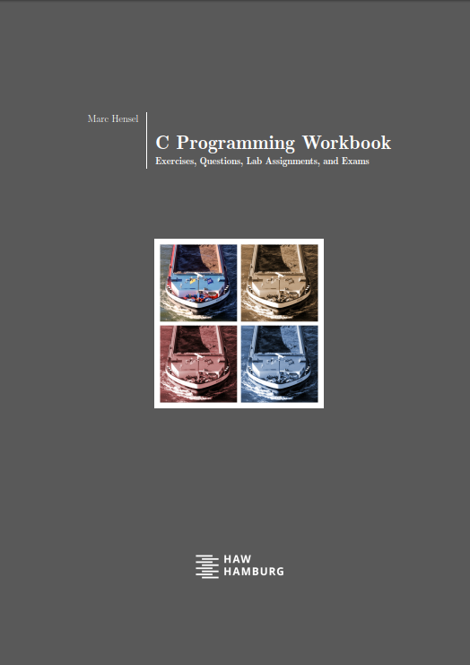
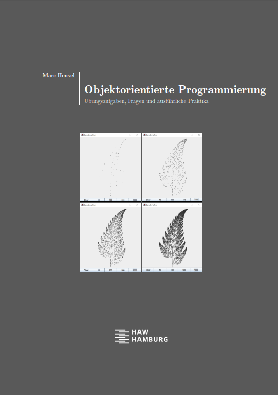
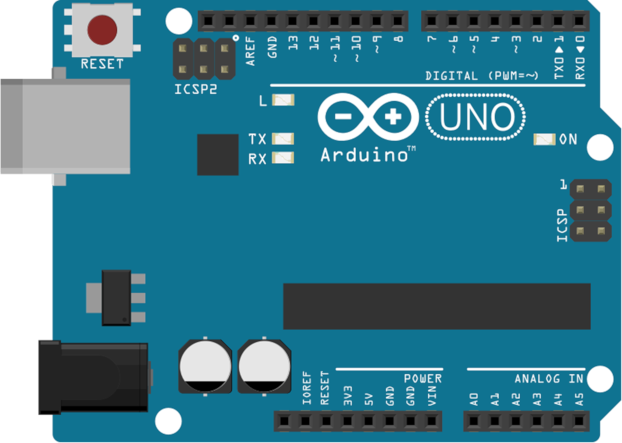

# Coding learners (C, Java, Arduino)
Teaching at Hamburg University of Applied Sciences (HAW Hamburg) since 2010, I have created lots of material for my students over the years. For software development in C and Java this includes sample codes used in lectures as well as __workbooks__ containing exercises, questions, lab assignments, and exams. Students use these to apply, apply, and apply by practical coding. In the end, I want my students to have fun _doing_ things and apply, not learn books by heart. I am convinced that this will help them become good engineers.

This raised the question, why not share material with ... well, _you_, for instance, in case you find it helpful for your students or yourself. So this is exactly what I do:

- C programming
- Java programming
- Arduino boards (short introduction)

> [!TIP]
> Additional material such as lecture slide sets and scripts are available for students at HAW Hamburg. Please refer to the electronic classroom.

# C and Java

### Overview
The workbooks contain a large number of exercises with sample solutions, questions, extensive lab assignments, and exams with sample solutions (C, only). Additionally, sample codes used in my lecture are provided.

> [!NOTE]
> C source codes are in Visual Studio solution files. 
> Java source codes are in [IntelliJ IDEA Community](https://www.jetbrains.com/idea/) projects.

### Uploaded material
- [X] Workbooks ([C](c/docs/) in English, [Java](java/docs/) in German)
- [X] Sample solutions for the exercises ([C](c/src/workbook/exercises), [Java](java/src/workbook))
- [X] Provided files and sample solutions for the exams ([C](c/src/workbook/exams))
- [X] Provided files for lab assignments ([C](c/src/workbook/labs), [Java](java/src/labs))
- [X] Sample codes used in the lecture ([C](c/src/lecture), [Java](java/src/lecture))

# Arduino boards

Arduino boards are quite cheap and easy to program, even for first-semester students. And it is easy to extend them by all sorts of sensors and actors, making them a perfect choice to apply all the theory covered in the lectures and create all sorts of systems (e.g., robotics) with only moderate effort. In this context, I have elaborated materials (slides and sample programs) to help my students learn quickly how to work with Arduinos. Maybe you find this material helpful as well.
 

### Fundamentals
The slide set _Fundamentals_ is intended to make you familiar with the commonly used boards such as UNO, Nano, and Mega. Apart from the Arduino board, only few low-cost parts are required (like breadboard, cables, LEDs, resistors, push button.) Also, an introduction how to use the "standard" ultrasonic distance sensor HC-SR04 is given. This cheap sensor, alone, can be a lot of fun already.

1. _Arduino board and IDE_ (Fundamental pins and interfaces, required software, basic program)
1. _Basic digital output_ (Create digital output signals, make LEDs blink in specific patterns)
1. _Digital output using PWM_ (Control the power of digital output pins, dim LEDs using PWM pins)
1. _Reading digital input_ (Read digital input pins, react to buttons, print to the IDE, generate random numbers, measure elapsed time and pulse lengths)
1. _Interrupts on digital input changes_ (React on voltage changes of digital pins, define interrupt handling)
1. _Measuring analog input_ (Measure voltages at analog pins)

### RC-controlled cars
As many student projects use RC model cars, there is an introduction how to control RC cars by Arduino boards. Topics covered include:

1. Receiver channels, signals, and principle components of a RC car
1. Control steering and throttle directly by Arduino-generated signals
1. Control steering and throttle by a servo / PWM driver board
1. Combine manual driving (i. e., with standard remote control) and Arduino control (e. g., assistance system)
1. Control via a Bluetooth module (e. g., by an Android app)

### Uploaded material
- [X] Slide sets ([PDF](arduino/docs/))
- [X] Source codes ([fundamentals](arduino/src/fundamentals), [RC cars](arduino/src/rc_cars))

## Contact
[Marc Hensel](http://www.haw-hamburg.de/marc-hensel), University of Applied Sciences Hamburg (HAW Hamburg)
